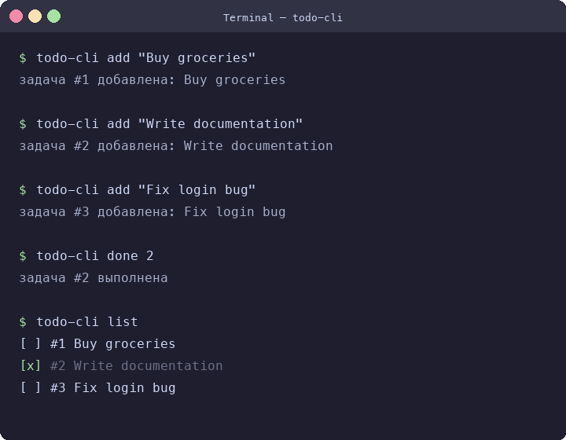
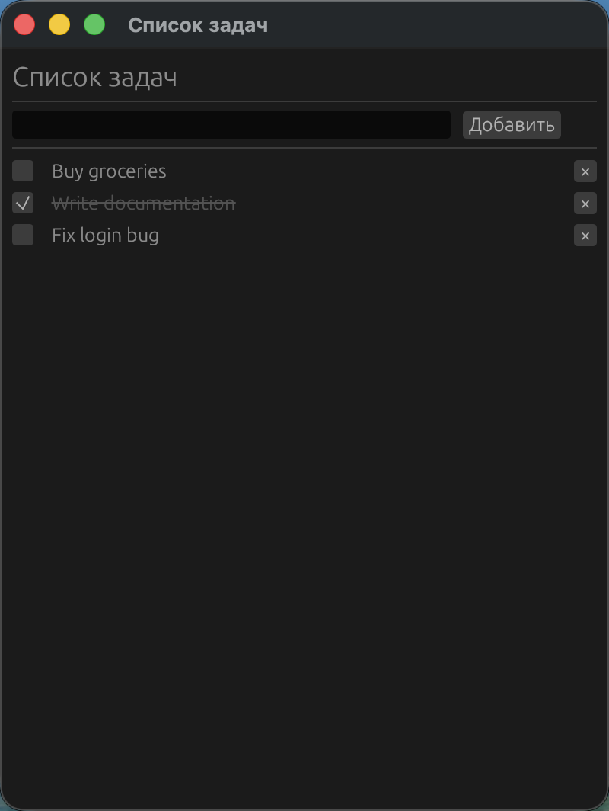

# todo-cli

A simple cross-platform command-line task manager written in Rust.

## Features

- Works on macOS, Linux, and Windows
- Simple and intuitive CLI interface
- Persistent storage in `~/.todo.json`
- Built-in GUI mode (egui)
- i18n support (English / Russian)

## Screenshots

### CLI



### GUI



## Commands

```bash
todo add <text>       # Add a new task
todo list             # Show all tasks
todo done <id>        # Mark task as completed
todo remove <id>      # Remove a task
```

## Build

```bash
cargo build --release
```

## Usage

```bash
./target/release/todo-cli add "Buy groceries"
./target/release/todo-cli list
./target/release/todo-cli done 1
```

## License

MIT